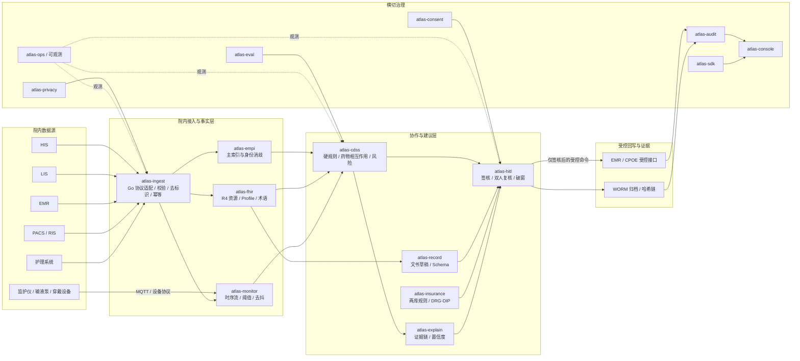
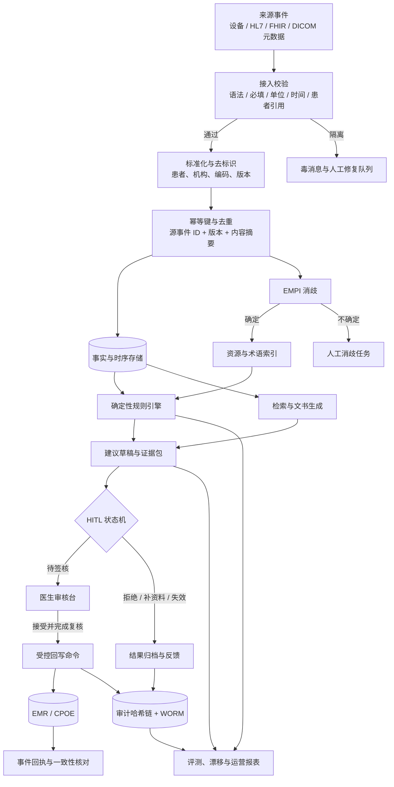
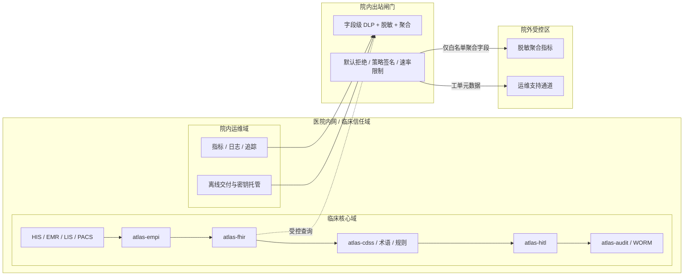
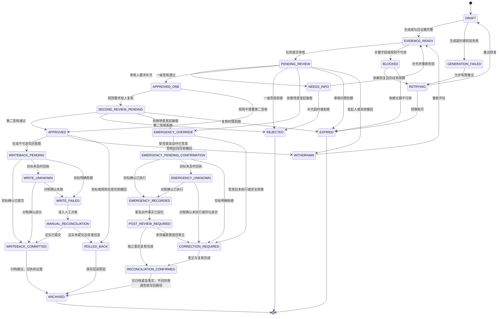
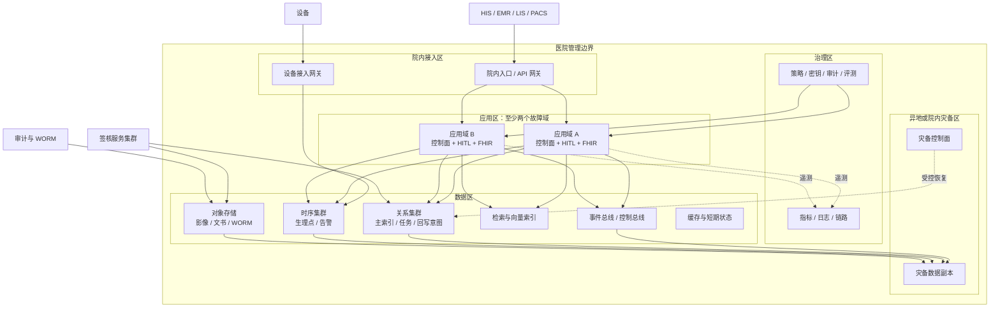

# Atlas 医疗智能体临床协作平台架构设计

> **定位红线：**Atlas 是临床协作、文书、审核与可审计层，**不做自主诊断决策、不做自动处方、不替代执业医师**。所有 AI 输出均为“建议”，必须经人工签核方可进入病历或医嘱；未签核路径必须在类型、状态机、服务和数据库约束层不可达。

本文是第一轮规划中的架构基线，围绕“先安全地协作，再逐步验证临床价值”展开。文中带有 `[待验证]` 的性能、规模、法规和标准陈述是规划假设或附件转述，不能在未完成来源核验和现场基准测试前当作已验证事实。文中所有容量数字均给出算式；涉及经验阈值的地方同时给出验证方法。

## 第 0 章　文档治理与阅读约定

> **当前角色：**医疗信息化首席架构师兼技术写作负责人。
>
> **本章产出：**架构文档的边界、术语、决策优先级和证据等级。
>
> **依赖的上游产出：**附件 `prompt-v2-medical.md` 的定位红线、硬指标、反模式和安全底线。

### 0.1 设计目标与优先级

| 优先级 | 目标 | 架构含义 | 验收证据 |
|---|---|---|---|
| 1 | 患者安全 | 建议与高危操作隔离；不确定、超时、冲突时拒绝放行 | 状态机穷举、临床安全评审、故障演练 |
| 2 | 合规与隐私 | 最小必要访问、授权留痕、院内闭环、不可覆盖审计 | 权限矩阵、脱敏测试、审计链验证报告 |
| 3 | 正确性 | 规则、术语、身份、时间和单位均可解释且可追溯 | 规则对拍、FHIR 校验、身份消歧评测 |
| 4 | 可观测性 | 单次建议能追到输入、规则、模型、人工和回写 | traceId、证据链、回放样本 |
| 5 | 性能 | 在保护急诊链路的前提下满足容量目标 | 基准、压测、容量复算 |
| 6 | 代码量与交付效率 | 在安全和质量门禁内实现可维护的私有化交付 | 构建、离线安装、变更评审 |

上表体现附件给出的优先顺序。性能不能通过削弱签核、脱敏、审计或急诊隔离来换取；代码量也不能成为绕过测试的理由。

### 0.2 术语和证据等级

| 术语 | 本文定义 | 证据等级 |
|---|---|---|
| 建议 | 模型、规则或检索产生的候选信息，不具备直接临床效力 | 设计定义 |
| 签核 | 具有相应职责和权限的临床人员对建议内容、证据和责任作出的可追溯确认 | 需求定义 |
| 硬规则 | 可由确定性输入和规则版本计算出的禁忌、相互作用、剂量上限等判断 | 设计定义 |
| 证据链 | 建议对应的具体指南条目、检验值、药品版本、时间点和来源引用 | 设计定义 |
| 计划假设 | 尚未在目标医院、数据规模和网络环境中验证的数值或行为 | `[待验证]` |
| 外部事实 | 需要回到正式发布渠道核对名称、文号、日期、适用范围和原文的陈述 | `[待验证]`，见第 9 章 |

## 第 1 章　业务边界与能力地图

> **当前角色：**临床信息学顾问与医疗信息化产品架构师。
>
> **本章产出：**平台内外的责任边界、能力分层和可度量目标。
>
> **依赖的上游产出：**第 0 章的定位红线、证据等级和优先级。

### 1.1 平台服务边界

| 边界内 | 边界外 | 说明 |
|---|---|---|
| 临床文书草稿生成与结构化 | 医师独立诊断 | 文书必须由医师审阅、修改、签核；平台不输出不可逆的诊断结论 |
| 指南、药品、医保等规则提示 | 自动开立处方或自动签署医嘱 | 规则输出为警示、提示或拦截建议，写回由授权人员和受控接口完成 |
| 医生工作站和审核台 | 替代执业医师的独立判断 | 平台呈现证据、责任和差异，不代替人的判断 |
| 院内数据接入、身份消歧、检索和审计 | 将原始诊疗数据送到院外 | 原始数据、患者标识、影像、提示词和可回放日志留在院内 |
| 评测、漂移监测、停用和回滚 | 未经验证的临床效果承诺 | 评测结果必须带数据构成、阴性对照和适用边界 |

### 1.2 能力分层

| 层级 | 能力 | 输入 | 输出 | 失败时行为 |
|---|---|---|---|---|
| L0 数据层 | 接入、解析、校验、标准化、幂等 | HL7、FHIR、DICOM 元数据、设备流 | 可追溯事件和资源 | 进入隔离队列，不污染主索引 |
| L1 事实层 | EMPI、术语、检验、药品、医嘱、影像报告 | 规范化资源 | 带版本的事实 | 身份不确定时转人工消歧 |
| L2 规则层 | 禁忌、相互作用、剂量、保险规则、风险阈值 | 事实和知识版本 | 确定性结论与命中解释 | 规则超时则拒绝生成相关建议 |
| L3 建议层 | 归纳、摘要、文书草稿、检索增强 | 受控上下文 | 结构化草稿 | 输出“不可用”，不让模型自由补全 |
| L4 协作层 | 任务分派、审核、签核、拒收、补资料 | 建议和证据 | 人工决定与下一步动作 | 任务进入待处理队列并升级 |
| L5 沉淀层 | 评测、审计、隐私、运维、版本 | 事件和结果 | 指标、证据包、停用信号 | 审计不可用时临床写入熔断 |

### 1.3 硬指标及复算口径

下表把附件的硬指标转成架构验收口径。除特别注明外，数字是目标值而不是现场实测结论；现场结果必须由基准和压测报告给出。

| 指标 | 目标值 | 复算公式或推导 | 证据与验证方法 |
|---|---:|---|---|
| EMPI 规模 | 10,000,000 条 | 26 个实例 × 500,000 条/实例 = 13,000,000；冗余余量为 30% | 导入合成主索引，抽样重放消歧；[待验证] 单实例容量 |
| 设备并发 | 100,000 台 | 以每台设备平均 10 点/秒计，100,000 × 10 = 1,000,000 点/秒 | 设备模拟器、时序库写入和端到端告警延迟；[待验证] 点频分布 |
| AI 建议 | 10,000,000 次/月，峰值 200 次/秒 | 月均 = 10,000,000 ÷ (30 × 24 × 3600) ≈ 3.86 次/秒；峰值 ÷ 均值 ≈ 51.8 | 用 13 个实例 × 20 次/秒 = 260 次/秒；基准包含模型、规则和超时；[待验证] |
| 病历检索 | 1,000,000 份并发，P99 < 800ms | 25.6 万 QPS 是服务吞吐，不等同于并发数；并发需用 Little 定律单独核算，见第 7 章 | 记录每个旅程的并发用户、在途请求和服务时间；[待验证] |
| 文书生成 | 10,000 份/小时，P95 < 20s | 10,000 ÷ 3600 ≈ 2.78 份/秒；13 × 20 = 260 次/秒是建议实例容量，不能直接等同于文书生成能力，文书管线吞吐需单独实测 | 以完整 Schema 校验和人工审核台提交为终点；[待验证] 一次建议与一份文书的对应关系 |
| 审计事件 | 20 亿条/天 | 2,000,000,000 ÷ 86,400 ≈ 23,148 条/秒；104 个实例的规划能力见第 7 章 | 持续写入、哈希链校验和 WORM 不可覆盖测试；[待验证] |
| 签核覆盖 | 100% | 1,000,000 次可写建议中，签核数 ÷ 可写建议数 = 1；未签核写入数 = 0 | 100 条绕过路径全部拒绝并留审计；[待验证] 路径清单需由安全评审冻结 |
| 签核时延 | P99 < 500ms | 从审核台开始加载任务/证据到提交并获得持久化回执的端到端时间；服务端提交子指标另列 | 5,000 名审核者并发旅程；[待验证] 端到端网络与渲染分布 |
| 可用性 | 月度 ≥99.95%；急诊 ≥99.99% | 月度不可用预算 = 43,200 × (1 − 0.9995) = 21.6 分钟；急诊 = 4.32 分钟 | 故障注入与可用性报告；[待验证] 计算是否按自然月、跨组件是否去重 |
| 院内闭环 | 100% 原始数据 | 原始数据外发量 = 0；外发白名单字段 = 脱敏聚合指标 | 出站代理抓包、字段级 DLP 测试；[待验证] 现场网络与中间件清单 |
| 私有化交付 | 离线可安装 | 镜像、依赖、校验和、证书模板、演练记录形成同一交付包 | 断网安装并复测关键旅程；[待验证] 信创组合兼容性 |

## 第 2 章　系统拓扑与组件责任

> **当前角色：**Go 平台负责人与 SRE。
>
> **本章产出：**院内逻辑拓扑、组件边界、数据分类和故障隔离关系。
>
> **依赖的上游产出：**第 1 章的能力分层和硬指标。

### 2.1 逻辑拓扑图



拓扑图中的实线是临床数据或受控命令路径，虚线是可观测性路径。`atlas-hitl` 是建议进入病历或医嘱的不可绕过闸门；任何其他服务都不能直接写 CPOE。横切服务以事件或受控查询接入，不改变临床事实的来源归属。

### 2.2 组件责任和故障策略

| 组件 | 主要责任 | 权威数据 | 故障策略 | 禁止事项 |
|---|---|---|---|---|
| `atlas-ingest` | 协议解析、字段校验、去标识、幂等、乱序缓冲 | 接入事件与原始引用 | 持久化重试；毒消息隔离；不丢审计 | 不把未校验报文直接送入规则或模型 |
| `atlas-empi` | 患者索引、确定性匹配、概率匹配、人工消歧 | 身份关系与版本 | 不确定即挂起；禁止自动合并高风险冲突 | 不用单一概率分数直接合并身份 |
| `atlas-fhir` | R4 资源、Profile、术语映射、查询索引 | 标准化资源和术语版本 | 官方校验失败进入隔离；查询降级到明确错误 | 不硬编码未经确认的字段或编码 |
| `atlas-monitor` | 设备点、趋势、阈值、告警去抖 | 生理时序和告警状态 | 设备离线可见；积压有界；过期点不补作实时告警 | 不把高频原始点全部送入生成模型 |
| `atlas-cdss` | 硬规则、风险分层、证据引用 | 规则命中与版本 | 规则库不可用时拒绝相关高危建议 | 不让 LLM 判定药物相互作用或剂量上限 |
| `atlas-record` | 生成结构化文书草稿 | 草稿和校验结果 | Schema 不通过则不进入审核台 | 不把自由文本直接写入病历 |
| `atlas-insurance` | 医保规则检索、分组和解释 | 规则版本与分组结果 | 规则缺失时显示不可用并转人工 | 不把不同口径的支付规则混成一条结论 |
| `atlas-hitl` | 任务、证据、签核、双人复核、破窗、回写许可 | 协作状态和责任 | 无签核不可写；超时有明确升级 | 不提供“一键自动通过”接口 |
| `atlas-explain` | 证据链、置信度校准、差异解释 | 解释包 | 解释缺失时建议不可展示为可执行 | 不用“模型认为”作为证据 |
| `atlas-audit` | 哈希链、国密签名、WORM、校验接口 | 审计事件 | 审计写入失败时阻断临床写入 | 不允许覆盖或删除历史事件 |
| `atlas-privacy` | 最小必要、脱敏、风险评分、出站检查 | 脱敏策略与检查结果 | 出站闸门默认拒绝 | 不让云端看到原始诊疗字段 |
| `atlas-consent` | 授权、用途、范围、紧急破窗 | 同意状态和撤销记录 | 无有效授权时仅显示最小必要信息 | 不把默认勾选当作完整知情同意 |
| `atlas-console` | 医生工作站、审核台、管理视图 | 展示状态，不替代权威源 | 加载失败显示状态而非伪造空值 | 不在前端成为唯一安全边界 |
| `atlas-ops` | 部署、配置、升级、备份、混沌、观测 | 配置和运行状态 | 分批回滚；签名发布 | 不手工改生产密钥或跳过审计 |

## 第 3 章　数据流、时序与一致性

> **当前角色：**FHIR 互操作专家、数据平台架构师与测试架构师。
>
> **本章产出：**从设备到建议再到受控回写的数据流图、顺序保证和失败处理。
>
> **依赖的上游产出：**第 2 章组件拓扑和故障策略。

### 3.1 数据流图



### 3.2 端到端顺序保证

| 阶段 | 顺序键 | 至少一次投递的处理 | 幂等和去重 | 可重放来源 |
|---|---|---|---|---|
| 接入 | `sourceSystem + eventId + eventVersion` | 消费位点落后时重放；原文不可变保存 | 内容摘要一致则返回既有结果 | 接入事件日志和协议适配器 |
| 身份 | `patientScope + candidateSet + ruleVersion` | 消歧任务可重新计算 | 同一规则版本和输入摘要只产生一个决策 | 匹配特征快照 |
| 规则 | `factVersion + ruleSetVersion + effectiveAt` | 规则包滚动加载 | 决策记录绑定输入、规则和术语版本 | 事实快照与规则包 |
| 建议 | `taskId + promptTemplateVersion + modelVersion` | 超时重试不重复创建任务 | 任务级幂等键和输入摘要 | 受控上下文包 |
| 签核 | `taskId + stateVersion` | 提交事件可重放 | 乐观锁版本；重复提交返回同一回执 | 状态事件和审计事件 |
| 回写 | `writeIntentId + resourceVersion` | 网络重试不重复执行 | 业务端按意图 ID 查重 | 意图、响应和回执 |
| 审计 | `eventId + previousHash` | 写入失败进入补写队列 | 事件 ID 和链位置唯一 | 链头、批次和 WORM 归档 |

### 3.3 关键数据处理规则

1. **时间语义：**每个临床事件同时保留来源时间、接收时间、标准化时间和单调序号。设备时钟漂移超过现场阈值时标记 `CLOCK_UNCERTAIN`，不静默改写；阈值由校准报告确定，初始值属于 `[待验证]`。
2. **单位语义：**检验、药品剂量、生命体征在进入规则前完成单位转换，保留原值、转换式、术语版本和操作者。任何无法转换的值进入人工核验。
3. **去标识化：**接入层只把经批准的最小字段交给索引或建议服务；原始值留在受控事实库。去标识化采用泛化、抑制和可配置 k 值，风险评估参数标为 `[待验证]`。
4. **乱序与迟到：**实时告警以事件时间和接收时间双水位处理；超出迟到窗口的点只进入回溯分析，不补发已过期的临床提醒。窗口值由病区场景测试确定。
5. **一致性回执：**回写 EMR/CPOE 后必须获得带业务幂等键的成功、拒绝或未知回执；未知回执进入对账，不重复开立。
6. **可解释输入：**建议上下文由资源引用、规则命中、术语定义和时间窗组成，限制自由文本和超长病历直接注入；上下文大小预算和截断策略标为 `[待验证]`。

## 第 4 章　数据不出院边界与最小必要

> **当前角色：**隐私与安全负责人，含等保三级和密评材料对照视角。
>
> **本章产出：**院内信任边界、外发白名单、脱敏检查和不可出院的字段集合。
>
> **依赖的上游产出：**第 2 章拓扑、第 3 章数据流和第 1 章硬指标。

### 4.1 数据不出院边界图



**边界判定：**原始诊疗数据、临床上下文和模型输入均不得离开医院内网；临床推理使用院内本地模型。唯一允许的出站数据是经脱敏、去标识、聚合、小样本抑制且经过策略签名的运营指标；院外模型服务不接收临床上下文。边界图是逻辑边界，实际网络还需由防火墙、出站代理、容器网络策略和密钥隔离共同执行。

### 4.2 字段分类和外发规则

| 分类 | 示例 | 院内处理 | 可否出院 | 理由 |
|---|---|---|---|---|
| 直接标识 | 姓名、证件号、精确住址、联系电话 | 事实库加密，界面按角色脱敏 | 否 | 可直接或组合识别个人 |
| 准标识 | 精确出生日期、完整就诊号、设备序列号 | 令牌化或泛化，保留院内映射 | 否，除非经审批的不可逆聚合 | 组合识别风险随数据集规模上升 |
| 临床原始 | 检验值、诊断文本、影像、医嘱、病理 | 受控事实库和临床库 | 否 | 直接诊疗数据必须院内闭环 |
| 模型上下文 | 规则事实、结构化摘要、证据引用 | 仅院内本地推理，字段最小化 | 否 | 上下文可能包含可识别病历片段，不得作为院外模型输入 |
| 聚合运营指标 | 队列长度、延迟分位数、脱敏错误类型 | 院内统计并去除小样本 | 可，按白名单 | 不包含个体级事实，样本量需达策略阈值 |
| 模型质量指标 | 版本、漂移、召回率、拒答率 | 关联评测集标识而非患者标识 | 可，按审批 | 评测结果需可复现且不含样本原文 |
| 运维诊断 | 错误码、版本、拓扑、时延 | 脱敏、限权、短时留存 | 原则上否；紧急支持须审批 | 诊断价值不应凌驾于隐私边界 |

### 4.3 出站检查流程

1. 出站代理先检查目的地址、端口、租户、用途、时间窗和数据分类。
2. 字段级脱敏器对每一列执行字典、标识符、熵和组合键检查；小样本聚合使用可配置抑制阈值，阈值为 `[待验证]`。
3. 策略引擎校验数据用途、授权范围、处理者、保留期限和签名版本。
4. 通过后生成外发批次号，审计记录 who、when、what、why、policy、fields、destination；why 来自业务上下文，不能是任意备注。
5. 出站后以对账任务确认接收方实际字段集合，发现差异立即吊销策略并触发事件。

## 第 5 章　HITL 状态机全集与强制性

> **当前角色：**临床安全负责人、Go 平台负责人和合规审查员。
>
> **本章产出：**从建议生成到回写、拒收、破窗、过期、回滚和归档的完整状态机及不可绕过约束。
>
> **依赖的上游产出：**第 1 章定位红线、第 2 章组件责任和第 3 章顺序保证。

### 5.1 HITL 状态机全集图



图中从 `APPROVED` 到 `WRITEBACK_PENDING` 只表示获得签核许可，不表示临床动作已经发生。只有 `WRITEBACK_COMMITTED` 才能向 EMR/CPOE 声称成功；`WRITE_UNKNOWN` 必须先对账，不能重试造成重复动作。`APPROVED` 的两条撤回边互斥：尚未生成写回意图时进入 `WITHDRAWN`，已经生成意图但目标未提交时进入 `ROLLED_BACK`，不能由实现任意选择。`EMERGENCY_OVERRIDE` 是抢救场景的受控例外：紧急动作必须经过独立的 `EMERGENCY_PENDING_CONFIRMATION`/对账链，事后进入 `POST_REVIEW_REQUIRED`；该分支没有回到 `APPROVED` 或 `WRITEBACK_PENDING` 的路径，因此不会借破窗重复执行普通建议。

### 5.2 状态转移和责任表

| 状态 | 进入条件 | 允许的下一状态 | 责任人 | 必须记录 | 不可做事项 |
|---|---|---|---|---|---|
| `DRAFT` | 创建建议任务 | `EVIDENCE_READY`、`GENERATION_FAILED` | 编排服务 | 输入版本、任务 ID | 不可对外展示为临床结论 |
| `GENERATION_FAILED` | 超时、模型或 Schema 失败 | `RETRYING`、`EXPIRED` | 编排服务 | 错误类别、重试次数 | 不可用空结果冒充成功 |
| `RETRYING` | 允许有限重试 | `DRAFT`、`EXPIRED` | 编排服务 | 预算、触发原因 | 不可无限重试 |
| `EVIDENCE_READY` | 证据和规则完整 | `PENDING_REVIEW`、`BLOCKED` | 证据服务 | 证据引用、规则版本 | 不可缺少引用进入审核 |
| `BLOCKED` | 术语、规则或字段不可用 | `RETRYING`、`EXPIRED` | 值班人员 | 阻塞原因、告警 | 不可静默降级为无风险 |
| `PENDING_REVIEW` | 审核任务已投递 | 多个审核转移 | 一级审核人 | 人员、意见、时间 | 不可由建议发起者自动通过 |
| `NEEDS_INFO` | 审核人要求资料 | `EVIDENCE_READY`、`REJECTED` | 资料提供者 | 缺失字段、回复 | 不可跳过补资料直接写回 |
| `APPROVED_ONE` | 一级签核通过 | `SECOND_REVIEW_PENDING`、`APPROVED` | 一级审核人 | 签名、角色、意见 | 不可绕过第二签核条件 |
| `SECOND_REVIEW_PENDING` | 规则要求双人复核 | `APPROVED`、`REJECTED`、`EXPIRED` | 独立第二审核人 | 两人身份和先后 | 不可由同一人补签第二栏 |
| `APPROVED` | 所需签核均完成 | `WRITEBACK_PENDING`、`WITHDRAWN`、`ROLLED_BACK` | 签核策略服务 | 签核集合、规则条件 | 不可由普通服务写回 |
| `EMERGENCY_OVERRIDE` | 抢救且满足策略，紧急动作已由授权人员签发 | `EMERGENCY_PENDING_CONFIRMATION` | 值班临床人员 | 原因、动作范围、通知链、一次性挑战 | 不可回到普通 `APPROVED` 写回路径 |
| `EMERGENCY_PENDING_CONFIRMATION` | 紧急动作已发送至目标系统 | `EMERGENCY_RECORDED`、`EMERGENCY_UNKNOWN` | 回写适配器 | 目标、幂等键、版本、发送时间 | 不可把发送成功当作临床执行成功 |
| `EMERGENCY_UNKNOWN` | 目标回执不确定 | `EMERGENCY_RECORDED`、`CORRECTION_REQUIRED` | 对账服务 | 查询次数、响应摘要、人工核实 | 不可自动重发或假定失败 |
| `EMERGENCY_RECORDED` | 对账确认紧急动作已执行 | `POST_REVIEW_REQUIRED` | 审计/临床服务 | 实际执行事实、执行者、时间 | 不可删除或覆盖紧急动作记录 |
| `POST_REVIEW_REQUIRED` | 紧急动作事实已固化 | `RECONCILIATION_CONFIRMED`、`CORRECTION_REQUIRED` | 指定独立复核组 | 事后时限、复核结论、差异 | 不可转回普通签核或重复执行 |
| `CORRECTION_REQUIRED` | 事后复核发现偏差或未执行 | `RECONCILIATION_CONFIRMED` | 临床安全负责人 | 更正动作、责任人、审批链 | 不可抹除原紧急事实 |
| `RECONCILIATION_CONFIRMED` | 独立复核和必要更正完成 | `ARCHIVED` | 审计服务 | 复核签名、处置结论 | 不可回到普通 `WRITEBACK_PENDING` |
| `WRITEBACK_PENDING` | 生成写回意图 | `WRITEBACK_COMMITTED`、`WRITE_UNKNOWN`、`WRITE_FAILED` | 回写适配器 | 目标、幂等键、版本 | 不可直接重试未知回执 |
| `WRITE_UNKNOWN` | 目标未在时限内回执 | `WRITEBACK_COMMITTED`、`WRITE_FAILED` | 对账服务 | 查询次数、响应摘要 | 不可假定失败并重发 |
| `WRITEBACK_COMMITTED` | 目标确认业务提交 | `ARCHIVED` | 目标系统 | 业务回执、签名 | 不可再次创建同一意图 |
| `REJECTED` | 人工或规则终止 | `[*]` | 审核人 | 原因、证据 | 不可转为已签核 |
| `EXPIRED` | 时限、预算或依赖失效 | `[*]` | 值班服务 | 失效时间和通知 | 不可静默留存待执行 |
| `ROLLED_BACK` | 提交前撤回或对账证实未提交 | `ARCHIVED` | 回滚审批人 | 前后状态、原因 | 不可抹除原决策 |
| `ARCHIVED` | 证据、回执、审计齐全 | `[*]` | 审计服务 | 保留策略、链位置 | 不可覆盖归档内容 |

### 5.3 三重强制防线

| 防线 | 强制点 | 失败检测 | 责任 |
|---|---|---|---|
| 类型与状态机层 | `ApprovedWriteIntent` 类型只能由完成状态转移的构造器生成；普通建议类型无回写方法 | 构造非法对象或反射绕过时编译/测试失败 | 平台与安全 |
| 服务层 | `atlas-hitl` 检查签核集合、角色独立性、有效期、同意和写回幂等键 | 缺任一条件即拒绝并生成审计 | 协作服务 |
| 数据库层 | 普通写入表约束要求有效签核事件 ID、状态版本和目标版本；抢救表使用独立 `EmergencyActionGrant`/意图约束，不能插入普通批准证书或进入 `COMMITTED` | 任意直写、证明替换、过期/重放或越权更新触发拒绝 | 数据与 SRE |

破窗流程必须同时满足：抢救场景标识、时间窗、值班人员和第二联系人、目标动作范围、事后复核时限、不可删除审计。紧急动作的执行事实必须先经目标回执或对账确认，再进入事后独立复核；任何未知回执都不得自动重发。破窗失败时系统应提供不含患者内容的本地应急清单，不能自动扩大权限。

## 第 6 章　部署拓扑与私有化交付

> **当前角色：**SRE、平台工程负责人和离线交付架构师。
>
> **本章产出：**院内生产拓扑、网络分区、节点角色、灾备和离线安装路径。
>
> **依赖的上游产出：**第 2 章逻辑拓扑、第 4 章数据边界和第 5 章 HITL 约束。

### 6.1 部署图



图中 `HITL`、`AUDIT` 虽与其他服务同处应用区，但在代码、数据库和网络策略上作为独立安全域部署；急诊流量使用独立资源池、队列和降级策略，不能与普通门诊建议争抢同一队列。

### 6.2 部署域和故障隔离

| 部署域 | 组件 | 最小冗余规划 | 故障影响 | 隔离措施 |
|---|---|---|---|---|
| 接入域 | `atlas-ingest`、设备网关 | 跨故障域多副本 | 新数据延迟，历史数据可读 | 按来源和院区限流；毒消息隔离 |
| 临床应用域 | FHIR、CDSS、文书、HITL | 每服务至少跨两个故障域 | 建议暂停，签核和急诊保护优先 | 急诊队列、资源配额、独立连接池 |
| 数据域 | 关系、时序、检索、对象存储 | 关系三副本；时序和对象存储多副本 | 对应能力降级 | 读写分离、按租户分片、容量水位 |
| 治理域 | 审计、策略、密钥、评测 | 审计写入独立优先级 | 未审计不得写回；密钥不可用则只读 | 与业务域分网、专用证书、双人运维 |
| 灾备域 | 数据副本和控制面 | 备份加密、演练可恢复 | 主域不可用时按预案恢复 | 明确 RPO/RTO、恢复顺序和人工接管 |

### 6.3 离线交付流程

| 阶段 | 输入 | 产物 | 门禁 |
|---|---|---|---|
| 依赖固化 | 镜像、SDK、规则、术语、模型 | 带摘要的离线包 | 依赖许可证和恶意扫描通过 |
| 环境预检 | CPU 架构、操作系统、存储、证书、端口 | 环境差异报告 | 关键能力逐项验证；兼容性为 `[待验证]` |
| 安装 | Helm/Operator 或等价安装描述 | 命名空间、密钥引用、策略、存储类 | 无公网也能启动并完成健康检查 |
| 校准 | 术语、规则、时钟、审计链、性能基线 | 校准报告 | 结果写入版本库，不在包内藏匿临时值 |
| 演练 | 断网、节点故障、回滚、恢复 | 验收报告 | 急诊链路、签核链和数据边界均通过 |
| 交接 | 运维手册、应急联系人、证据包 | 交付清单 | 医院安全、临床和运维共同签收 |

## 第 7 章　容量模型与性能预算

> **当前角色：**压测工程师、SRE 和性能架构师。
>
> **本章产出：**可复算的单实例假设、集群容量、并发澄清、存储和压测验收方法。
>
> **依赖的上游产出：**第 1 章硬指标、第 2 章组件规格和第 3 章端到端数据流。

### 7.1 假设和单实例容量

下表的单实例容量全部是规划假设，均标为 `[待验证]`。验证方式是用同规格裸机或同规格容器、固定数据集和固定模型进行不少于 72 小时稳态测试，记录 CPU、内存、磁盘、网络、尾延迟和错误率。没有 benchmark 证据时，不得把“单实例容量”写成产品承诺。

| 组件 | 规划规格 | 单实例容量假设 `[待验证]` | 规划实例数 | 集群算式与目标对照 |
|---|---|---:|---:|---|
| `atlas-ingest` | 16 vCPU / 64 GB | 50,000 消息/秒 | 26 | 26 × 50,000 = 1,300,000 消息/秒；相对 1,000,000 点/秒目标有 1.3 倍规划余量，但消息与点的换算需实测 |
| EMPI | 16 vCPU / 64 GB | 500,000 主索引 | 26 | 26 × 500,000 = 13,000,000；相对 10,000,000 有 3,000,000 条余量 |
| FHIR | 16 vCPU / 64 GB | 8,000 QPS | 47（最低） | 47 × 8,000 = 376,000 QPS 毛容量；按 30% 可用余量为 263,200 QPS，仅比 260,000 目标高 1.2%；32 台仅 256,000 QPS，不满足 MP-01 |
| CDSS | 16 vCPU / 64 GB | 20 次建议/秒 | 13 | 13 × 20 = 260 次/秒；月均 10,000,000 ÷ 2,592,000 = 3.86 次/秒，峰值系数为 200 ÷ 3.86 ≈ 51.8 |
| monitor | 32 vCPU / 128 GB / NVMe | 250,000 点/秒 | 6 | 6 × 250,000 = 1,500,000 点/秒；相对 1,000,000 点/秒有 1.5 倍规划余量 |
| audit | 16 vCPU / 64 GB / WORM | 25,000,000 条/天 | 104 | 104 × 25,000,000 = 2,600,000,000 条/天；相对 2,000,000,000 有 1.3 倍规划余量 |
| 关系库 | 32 vCPU / 128 GB | 12,000 TPS | 24 节点、32 分片、3 副本 | 24 × 12,000 = 288,000 TPS；“单节点还是单分片”必须由基准定义，暂为 `[待验证]` |
| 分析库 | 32 vCPU / 256 GB / NVMe | 200,000,000 条/天 | 12 | 12 × 200,000,000 = 2,400,000,000 条/天；相对审计写入目标有 1.2 倍规划余量 |
| console 网关 | 24 vCPU / 64 GB | 200,000 WebSocket | 6 | 6 × 200,000 = 1,200,000 连接；连接心跳和消息大小需压测 |
| 压测机 | 32 vCPU / 64 GB / 25 GbE | 50,000 消息/秒 | 40 | 40 × 50,000 = 2,000,000 消息/秒，是 1,000,000 目标点的 2 倍施压能力；全部使用合成数据 |

### 7.2 并发检索的 Little 定律澄清

“1,000,000 份并发检索”必须先定义 `L` 的单位。下面给出三种不混淆的结果。设每个临床检索旅程包含 `a=4` 次 FHIR 调用，单次调用平均服务时间 `s=0.2 秒`：

```text
情形 A：L = 1,000,000 个同时活跃的检索旅程，4 次调用顺序执行
  W_journey = a × s = 4 × 0.2 = 0.8 秒
  λ_journey = L ÷ W_journey = 1,000,000 ÷ 0.8 = 1,250,000 旅程/秒
  FHIR QPS = λ_journey × a = 5,000,000 QPS
  8,000 QPS/实例 → 625 个实例（未加余量）

情形 B：L = 1,000,000 个同时活跃的检索旅程，4 次调用同时在途
  W_journey ≈ s = 0.2 秒
  FHIR 在途调用 = L × a = 4,000,000
  λ_FHIR = 4,000,000 ÷ 0.2 = 20,000,000 QPS
  8,000 QPS/实例 → 2,500 个实例（未加余量）

情形 C：L = 1,000,000 个同时在途的单个 FHIR 请求
  λ_FHIR = L ÷ s = 1,000,000 ÷ 0.2 = 5,000,000 QPS
  8,000 QPS/实例 → 625 个实例（未加余量）
```

因此625和2,500都只是对应单位的理论值，不能用32台或47台宣称满足“100万并发”；`a=4`不能在顺序/并发两种模型之间混用。若1,000,000表示在线用户而非在途请求，另按每用户到达率 `λ_user` 重放：`FHIR QPS=4×1,000,000×λ_user`，并单独测量用户旅程。压测前必须冻结 L 的定义、调用顺序、突发系数和30%余量；现场参数均为 `[待验证]`。

### 7.3 存储、网络和批处理预算

| 资源 | 计算公式 | 规划结果 `[待验证]` | 观测和调整 |
|---|---|---:|---|
| 审计原始记录 | 2,000,000,000 条/天 × 1 KB/条 | 约 2 TB/天；30 天约 60 TB | 以实际事件序列化字节数、压缩率和保留期重算；WORM 不覆盖 |
| 审计副本与索引 | 60 TB × 3 副本 + 20% 索引与校验开销 | 约 216 TB（180 TB + 36 TB 校验余量；再单独计索引） | 每周抽样恢复，分离热、温、冷存储 |
| 设备时序原始点 | 1,000,000 点/秒 × 86,400 秒/天 | 86.4 十亿点/天 | 以每点压缩字节、保留窗口和降采样比例重算 |
| FHIR 检索调用（情形 C） | 5,000,000 QPS × 0.2 秒 = 1,000,000 在途请求 | 需要 625 个 8,000 QPS 实例的算式结果 | 仅用于暴露“单个 FHIR 请求”口径风险；顺序/并发旅程模型分别按 7.2 节计算，不作为默认部署数量 |
| 网络入口 | 1,000,000 点/秒 × 每点有效载荷 `b` 字节 × 8 | 流量为 `8,000,000b` bit/秒；例如 b=32 时约 256 Mbit/秒 | `b`、协议开销和突发系数需抓包；示例值属于 `[待验证]` |
| 建议月量 | 10,000,000 次/月 ÷ 30 天 | 约 333,333 次/天 | 峰谷比按 51.8 的规划值压测，真实分布需现场采样 |

### 7.4 压测门禁和场景映射

| 场景 | 负载公式 | 通过条件 | 需要先验证的假设 |
|---|---|---|---|
| 门诊高峰 | 26 万 QPS FHIR 读写，持续 8 小时 | P99 < 800ms，错误率 < 1×10^-6 | QPS 构成、读写比例、缓存命中率 |
| 索引风暴 | 1,000,000 新患者/2 小时 | 准确率 ≥99.9%，误合并为 0 | 候选集规模、重复率、人工队列 |
| 监护洪峰 | 100,000 台 × 10 点/秒 = 1,000,000 点/秒 | 告警端到端 P99 < 1s，无丢失 | 每台设备点数分布、重复点比例 |
| 审核并发 | 5,000 名审核者 | 加载+提交端到端 P99 < 500ms，无重复签核 | 页面数据量、证据包大小、网络 RTT、渲染和提交 |
| 审计洪峰 | 20 亿条/天持续 24 小时 | 哈希链连续，WORM 不可覆盖 | 事件字节数、签名吞吐、归档确认时间 |
| 急诊故障 | 杀掉 30% FHIR 节点并模拟一个故障域 | RTO < 60s，RPO 0 | 流量切换、连接重建和状态恢复 |
| 多院区隔离 | 一个院区打满，四个正常 | 正常院区 P99 波动 < 10% | 租户分片和共享资源比例 |
| 长稳测试 | 全量负载持续 72 小时 | 内存增长 < 2%，P99.9 漂移 < 10% | 垃圾回收、索引合并和泄漏基线 |

## 第 8 章　可靠性、灾备与运行策略

> **当前角色：**SRE、数据库架构师和临床连续性负责人。
>
> **本章产出：**急诊优先的 SLO、故障域、RPO/RTO、恢复顺序和容量保护策略。
>
> **依赖的上游产出：**第 5 章状态机、第 6 章部署域和第 7 章容量预算。

### 8.1 SLO 与错误预算

| 链路 | 目标 | 预算或计算 | 保护策略 |
|---|---|---|---|
| 急诊接入与告警 | 月度可用性 ≥99.99% | 43,200 分钟 × 0.0001 = 4.32 分钟/月 | 独立队列、资源池和人工降级流程 |
| 签核提交 | 加载+提交端到端 P99 < 500ms，100% 状态一致 | 从任务/证据加载开始到持久化回执；服务端提交子指标单列 | 乐观锁、幂等键、热路径只写必要字段 |
| 建议生成 | 月均 3.86 次/秒，峰值 200 次/秒 | 13 × 20 = 260 次/秒的规划能力；平均和峰值公式见第 7 章 | 令牌桶、队列隔离、超时熔断 |
| 审计写入 | 20 亿条/天且不可丢 | 23,148 条/秒是目标平均写入速率 | 写入失败阻断临床回写，不能静默丢弃 |
| 数据边界 | 原始数据外发 0 条 | 允许外发集合为策略签名白名单 | 出站代理、字段级检测、周期对账 |

### 8.2 故障域和恢复顺序

| 故障 | 预期行为 | RPO | RTO 目标 | 恢复顺序 |
|---|---|---:|---:|---|
| 单个应用实例退出 | 负载均衡摘除，其他实例继续；幂等重试 | 0（已提交事实） | < 60 秒 | 连接、会话、消费者、规则版本 |
| 单个数据副本损坏 | 从副本读取，禁止从未校验副本写入 | 0 | < 5 分钟 | 副本、索引、校验链、连接池 |
| 主库切换 | 事务状态按提交回执重放，未知状态先对账 | 0 | < 60 秒 | 选主、连接、业务回执、审计链 |
| 单个故障域不可用 | 跨域副本承接急诊，常规流量降级 | 0（急诊写回） | < 60 秒 | 急诊、签核、审计、常规建议 |
| 时间源异常 | 标记时间不确定，禁止据此静默改变临床顺序 | 0 | 依人工确认 | 校时、重放带时间事件、对账 |
| 术语服务不可用 | 拒绝需要新术语的建议，保留可验证的既有版本 | 0 | 依缓存 | 只读缓存、版本校验、人工处理 |
| 审计存储写满 | 停止新的临床回写，保留接收和告警 | 0 | 依扩容或切换 | 扩容、校验链、补写、恢复放行 |

“急诊 RPO 0”表示已确认写入的事实不丢失，不表示网络或硬件永不发生瞬时错误；未确认写入必须进入对账。RTO 小于 60 秒为规划目标，必须在故障演练中证明，初始结果为 `[待验证]`。

### 8.3 背压、幂等与重放

- 每条入口流设置有界队列，队列满时按优先级丢弃低优先级重复点，而不是无限增长内存。
- 消费位点、业务幂等键和审计事件 ID 分离提交；任何重试都必须先查询既有处理结果。
- 重放工具只接受事件 ID、版本和校验摘要，不接受人工直接编辑临床事实。
- 规则和模型灰度以租户、院区、任务类型和百分比为维度；同一任务固定到一个版本，避免回放时语义漂移。
- 监控重放延迟、重复率、隔离量、对账量和未知回执量；阈值为 `[待验证]`，初始报警以容量和 SLO 预算推导。

## 第 9 章　安全、隐私与 2026 规范核验

> **当前角色：**隐私与安全负责人，负责等保三级、密评和跨境风险的材料边界。
>
> **本章产出：**威胁模型、加密和访问控制方案、2026 外部陈述的核验方法。
>
> **依赖的上游产出：**第 4 章数据边界、第 5 章签核链和第 8 章灾备策略。

### 9.1 安全控制矩阵

| 控制面 | 设计控制 | 证据 | 失效动作 |
|---|---|---|---|
| 身份认证 | 院内统一身份或 CA 数字证书；服务间使用短期身份和双向认证 | 登录、证书轮换、撤销记录 | 禁用高风险操作，允许已定义只读路径 |
| 授权 | ABAC 结合角色、项目、用途、院区和同意；每次访问带 why | 策略快照、允许/拒绝日志、矩阵穷举 | 拒绝访问并通知策略管理员 |
| 传输 | 院内服务间优先国密或经批准的等效方案；外部通道经出站闸门 | 配置扫描、抓包、密钥轮换记录 | 断开未批准通道 |
| 存储 | 事实库、审计和备份分层加密；密钥与数据分离托管 | 密钥访问审计、恢复验证 | 禁止明文导出和未授权备份 |
| 完整性 | 审计哈希链、批次签名、WORM 和第三方校验接口 | 链验证器、篡改注入报告 | 发现断点即隔离并告警 |
| 供应链 | 镜像签名、依赖锁定、SBOM、离线来源校验 | 构建证明、漏洞扫描、签名验证 | 拒绝未签名制品 |
| 真实数据防护 | 合成数据生成、字典和熵检测、CI 阻断 | 数据扫描报告、人工复核 | 立即清理并冻结流水线 |
| 事件响应 | 最小权限、隔离、吊销、回滚和通知链 | 演练记录、时间线、复盘 | 按预案降级临床能力 |

### 9.2 附件中 2026 相关陈述的核验表

下表复述附件列出的 2026 信息，但全部标为 `[待验证]`。在验证前，它们只能作为项目风险线索，不能被写成已生效的法规、标准或采购条件。

| 附件陈述 | 当前处理 | 验证方法 | 验证前的架构动作 |
|---|---|---|---|
| 2026 年国家三部门出台《智能体规范应用与创新发展实施意见》 | `[待验证]` 文件名称、发布主体、文号、日期和适用范围 | 到发布机关官网或正式公报检索原文，保存 URL、版本和页码；由法务确认是否适用本平台 | 只把“双人复核、可解释、可追溯”作为内部安全原则，不把外部合规结论写入验收 |
| 等保 2.0 新增 AI 安全扩展、智能体进入关键信息基础设施资产清单 | `[待验证]` 清单名称、资产分类和强制性 | 查正式标准、测评指南和资产目录原文；由等保测评机构书面确认适用范围 | 按高安全基线设计隔离、审计和供应链控制 |
| 高危操作双人复核、自动拦截、过程可解释可追溯 | `[待验证]` 条款来源与医疗场景边界 | 对照正式文件逐条映射产品控制和证据；临床安全、法律、测评三方评审 | 内部默认对高危建议启用双人复核，保留破窗 |
| GA/T 2380—2026 对三级及以上系统要求 SM2/SM3/SM4 和实例 MAC 绑定 | `[待验证]` 标准正式状态、适用范围、算法参数和测试方法 | 购买或从正式标准渠道取得版本，核对术语、密码实现和认证测试；由密码合规人员复核 | 加密能力采用可插拔实现，先完成互操作和安全评审，不宣称已合规 |
| 2026 年 4 月药监局《“人工智能+药品监管”实施意见》 | `[待验证]` 正式标题、发布日期和目标年份 | 查药品监管机构正式发布页，下载原始文件并建立版本引用 | 药物规则来源、版本和审核责任独立管理 |
| 医疗机构智能体应用管理指南及医疗器械注册要求 | `[待验证]` 发布状态、适用对象、注册分类和具体条款 | 由法务、注册和质量团队查原文及主管机关解释；建立产品边界意见 | 只输出协作建议，诊断功能和注册路径不在本文件承诺内 |
| 未通过等保三级的 5 万–100 万元处罚 | `[待验证]` 金额区间、违法行为和地区差异 | 查阅有效处罚依据及案例，核对金额是否为上限区间；不把案例当普遍结论 | 以合规材料和测评计划为交付门禁，不用宣传数字驱动决策 |
| 个人医保云 13.3 亿人口、监管两库 88 类规则和 24.7 万知识点 | `[待验证]` 数据时点、公开来源、版本和适用范围 | 获取正式数据说明，做字段级来源核对和版本快照 | 医保规则按院内授权和本地版本运行，统计口径单独标记 |
| 2026 年中国 AI+医疗健康市场规模预计跨越 1500 亿元 | `[待验证]` 预测机构、口径、基年和置信区间 | 取得原报告，区分 AI 医疗解决方案、AI+医疗健康和 Agent+医疗三种口径 | 只用于商业规划背景，不用于容量或合规推导 |

**验证记录要求：**每条核验结果应包含来源、发布日期、抓取时间、适用范围、解释人、复核人和失效日期。无法取得正式来源时，文档状态保持 `[待验证]`，不得在销售材料、合同承诺或放行门禁中升级为事实。

### 9.3 密钥、证书和日志

1. 密钥按环境和用途分层：数据加密密钥、审计签名密钥、服务身份密钥和备份密钥分离；高权限操作采用双人审批。
2. 证书到期、轮换失败、时钟漂移和算法不兼容均进入 P1 安全事件；轮换窗口由现网握手和回滚演练确定，初始值为 `[待验证]`。
3. 应用日志默认不写姓名、证件号、原始病历、提示词、模型输入和访问令牌；调试采样需审批、加密、短时留存并可关联操作者。
4. 审计事件使用稳定序列号、事件 ID、前序哈希、事件摘要、签名密钥版本和策略版本；任何修复只能追加新事件，不能覆盖旧事件。
5. 国密算法的具体实现、硬件支持、证书链和性能须在目标信创环境做互操作测试；本文只定义算法适配接口，不把实现选择伪装成标准认证。

## 第 10 章　互操作、术语与身份模型

> **当前角色：**FHIR 互操作专家、临床信息学顾问和数据治理负责人。
>
> **本章产出：**FHIR、HL7、DICOM、设备协议、术语和 EMPI 的版本化边界。
>
> **依赖的上游产出：**第 2 章拓扑、第 3 章数据流和第 9 章治理要求。

### 10.1 互操作矩阵

| 来源 | 接入协议 | 目标模型 | 必做校验 | 失败处理 | 版本策略 |
|---|---|---|---|---|---|
| HIS/EMR | HL7 v2.x，必要时 FHIR 桥接 | 消息段到 FHIR 资源映射 | 字段类型、编码、患者引用、时间、幂等 | 进入隔离队列和修复任务 | 维护兼容矩阵，变更先过契约测试 |
| LIS | HL7 v2.x 或 FHIR R4 | Observation、Specimen、DiagnosticReport | 单位、参考区间、结果状态、方法 | 原值保留，转换错误不覆盖 | Profile 和术语版本绑定 |
| PACS/RIS | DICOM 元数据、报告 | ImagingStudy、Report、Observation | Study/Series/Instance 关联、报告状态 | 大对象延迟、报告先到时挂接 | DICOM tag 映射版本化 |
| 护理系统 | HL7/FHIR/接口表 | Observation、CarePlan、Task | 观察者、部位、单位和时间 | 不完整值不触发高危建议 | 变更需临床确认 |
| 监护设备 | 设备协议、MQTT 等 | 时序点和告警事件 | 设备身份、单位、序号、心跳 | 断线可见，异常点隔离 | 设备配置和时钟版本化 |
| 医嘱 | FHIR MedicationRequest、CPOE 接口 | 受控写回意图 | 临床版本、患者、药品版本、签核事件 | 未知回执先对账 | 目标端兼容矩阵 |

### 10.2 FHIR 资源和术语治理

- 以 FHIR R4 为基础建立院内 Profile，区分基础资源、Atlas 扩展和来源字段；扩展必须带稳定 URL、说明、基数、示例和版本。
- 影像大对象保留在对象存储，LLM 只接收经授权的结构化报告和元数据引用，不直接把影像像素或未经筛选的 DICOM 标签输入模型。
- LOINC、SNOMED CT、ICD、ICD-11、ATC 等术语按来源、许可、版本、生效日和停用日管理；具体编码和许可范围须在部署前核验，未确认编码标为 `[待验证]`。
- 任何硬编码编码都必须经过术语评审和契约测试；规则包升级先在影子环境对拍，再按院区和任务类型灰度。
- 统一时间、单位和标识符是语义层责任，不能让模型自行猜测缺失字段；模型只能提出候选，事实层负责确认。

### 10.3 EMPI 消歧策略

| 阶段 | 方法 | 输出 | 人工条件 |
|---|---|---|---|
| 确定性 | 证件规范化、机构内主键、联系方式哈希、时间冲突 | 确定匹配、非匹配、冲突 | 任一强标识冲突 |
| 概率 | 规则特征加 Fellegi-Sunter 类权重，输出概率与特征贡献 | 候选排序和置信区间 | 分数处于灰区或高影响任务 |
| 隐私保护 | 最小字段、分段查询、访问审计 | 可解释的匹配证据 | 需要查看额外字段时 |
| 提交 | 双人复核或指定角色确认 | 合并、分拆、保持分离 | 误合并代价高或置信度不足 |
| 监控 | 抽样复核、漂移、误合并和分拆趋势 | 规则版本调整建议 | 指标超过现场基线 |

误合并率目标 `<1×10^-6` 和身份消歧准确率 `≥99.9%` 均须通过带阴性候选的合成/伦理批准数据验证；不能仅用正例命中率报告。

## 第 11 章　AI、规则与可解释性边界

> **当前角色：**AI 平台架构师、临床评测负责人和安全审查员。
>
> **本章产出：**确定性规则与大模型的职责边界、证据链、置信度、灰度和强制停用机制。
>
> **依赖的上游产出：**第 1 章能力分层、第 5 章 HITL 和第 9 章治理控制。

### 11.1 规则与模型分工

| 场景 | 首选路径 | 模型可否参与 | 放行条件 | 失败动作 |
|---|---|---|---|---|
| 药物相互作用、禁忌、剂量上限 | 版本化确定性规则 | 只能解释和归纳，不能改判 | 规则库、药品版本、事实版本齐全 | 拒绝相关建议并转人工 |
| 指南条目检索 | 术语索引加规则匹配 | 只能重排和摘要 | 条目 ID、版本、原文定位完整 | 显示证据缺失 |
| 文书草稿 | 检索增强生成 | 可以生成结构化草稿 | JSON Schema、术语绑定和人工审核通过 | 留在草稿区，不写病历 |
| 风险趋势 | 时序规则和统计 | 可以解释趋势 | 数据延迟、时间窗和设备质量已知 | 标记数据质量风险 |
| 医保规则 | 规则库、分组器和本地配置 | 只能说明口径 | 规则版本、支付范围和患者授权明确 | 显示不可用，不猜测支付结果 |
| 诊断结论 | 不属于本平台自动输出范围 | 不提供自主诊断决策 | 必须由执业医师完成 | 拒绝自动诊断路径 |

### 11.2 结构化建议契约

每个建议至少包含：建议类型、输入事实引用、规则或检索版本、证据条目、适用人群与禁忌、置信度及其校准版本、生成时间、模型与提示模板版本、风险分层、建议动作、失效时间、任务状态和签核要求。自由文本只能存在于受控字段，不能绕过 Schema 写入病历。

JSON Schema 校验顺序为：结构完整性 → 术语存在性 → 引用可达性 → 单位与时间语义 → 证据覆盖 → 风险分层。任一步失败，任务留在 `DRAFT` 或 `BLOCKED`，不生成写回意图。

### 11.3 置信度和阈值分层

模型分数先经过 Platt 或 Isotonic 校准，再映射为提示、警示、拦截或仅供人工浏览。初始阈值、样本量和校准区间均为 `[待验证]`，验证方法是按时间切分回顾性评测集，报告 Brier 分数、ECE、置信区间、阴性对照和不同院区的分布差异。

| 分层 | 含义 | 系统行为 | 证据要求 |
|---|---|---|---|
| 提示 | 需要关注但不阻断 | 显示在草稿或工作列表 | 证据完整，审核人可见 |
| 警示 | 风险较高，需主动确认 | 进入优先队列，未签核不可写入 | 事实和规则版本可回放 |
| 拦截 | 规则或安全策略明确不允许 | 生成拒绝/升级建议 | 硬规则命中和理由可审计 |
| 不可用 | 证据、术语或依赖不足 | 拒绝生成或显示不可用 | 缺口清单和替代人工路径 |

### 11.4 模型生命周期和停用

模型与提示模板按不可变版本登记，灰度按院区、任务类型、医生角色或流量比例切分。触发强制停用的信号包括关键提醒召回下降、假阳性率上升、严重不良反应反馈、证据引用失真、隐私外泄、版本漂移和人工拒收激增；阈值由回顾性评测和现场基线确定，标为 `[待验证]`。

停用动作按“冻结新任务 → 保留只读证据 → 通知审核人 → 切换人工路径 → 保留审计 → 评估回滚”执行。停用不删除历史建议，不把未完成的任务伪装成已完成；任何回滚都要重新计算规则和证据版本。

## 第 12 章　失效模式与效应分析（FMEA）

> **当前角色：**测试架构师、SRE、临床风险负责人和隐私安全审查员。
>
> **本章产出：**覆盖临床、数据、模型、权限、供应链和运行故障的 40 条 FMEA 及处置优先级。
>
> **依赖的上游产出：**第 2 章组件责任、第 3 章数据流、第 5 章状态机、第 9 章安全矩阵。

### 12.1 评分方法

严重度 `S`、发生度 `O`、可探测度 `D` 采用 1 至 5 级，定义如下：1 表示影响轻微且通常可发现，5 表示可能造成严重临床伤害、不可逆合规损失或大范围不可用。风险优先级数 `RPN = S × O × D`，因此 RPN 不是概率预测，而是评审排序工具。

| 分值 | S：影响 | O：发生可能 | D：发现难度 |
|---:|---|---|---|
| 1 | 轻微、局部、可恢复 | 极少发生 | 现有控制通常能及时发现 |
| 2 | 有局部工作影响 | 偶发 | 单一告警可发现 |
| 3 | 明显流程或患者安全影响 | 偶尔发生 | 需要跨组件发现 |
| 4 | 严重临床、合规或连续性影响 | 反复发生 | 多处信号才可发现 |
| 5 | 致命或不可逆影响 | 高频或易被诱发 | 现有控制难以及时发现 |

RPN 仅用于排序；任何 `S=5` 的项目即使 RPN 较低，也必须由临床安全负责人单独审查。FMEA 编号是追踪标识，不代表风险数量。

### 12.2 FMEA 明细

| 编号 | 失效模式 | 可能原因 | 潜在影响 | 现有控制与检测 | S/O/D | RPN | 处置动作与触发条件 | 责任角色 |
|---|---|---|---|---|---:|---:|---|---|
| FMEA-01 | 未签核建议写入病历 | API 绕过状态机或旧版本客户端直写 | 患者接受未经审核内容 | 构造器、状态机、DB 触发器；拒绝即告警 | 5/2/2 | 20 | 任意非法写入即熔断回写通道并启动事件复盘 | HITL 负责人 |
| FMEA-02 | 双人复核实际由同一人完成 | 共享账号、角色映射错误或时间窗重叠 | 责任链失真 | 签名身份、第二审核人独立性和审计对账 | 5/2/3 | 30 | 发现同人签名立即撤销待写任务并通知安全团队 | 身份与 HITL |
| FMEA-03 | 抢救破窗变成常规通道 | 场景标识由普通请求伪造 | 高危操作绕过复核 | 破窗策略、双人通知、时限和事后复核 | 5/3/3 | 45 | 对高危任务默认关闭普通破窗入口，例外需现场策略 | 临床安全 |
| FMEA-04 | 签核后目标内容被悄悄修改 | UI 编辑与提交版本不一致 | 医师看到的内容和实际写入不同 | 版本锁定、摘要对比、二次确认 | 5/2/3 | 30 | 版本不匹配即拒绝提交并显示差异 | 回写适配器 |
| FMEA-05 | 未知回执触发重复医嘱 | 网络重试未查幂等结果 | 重复治疗或错误计费 | 写回意图 ID、对账、超时单列处理 | 5/3/3 | 45 | 未知状态只允许查询和对账，禁止直接重发 | CPOE 适配器 |
| FMEA-06 | 身份误合并 | 概率阈值过宽或字段冲突未处理 | 诊疗信息串患者 | 强标识冲突阻断、人工复核、抽样监控 | 5/2/4 | 40 | 误合并一例即回滚候选索引并开展影响范围分析 | EMPI 负责人 |
| FMEA-07 | 身份拆分后旧建议继续写入 | 分拆事件未级联冻结任务 | 建议引用错误患者 | 身份版本写入建议和回写意图 | 5/2/3 | 30 | 身份版本变化使旧任务转为 `BLOCKED` | EMPI/HITL |
| FMEA-08 | 时间漂移造成告警顺序错误 | 设备或服务时钟未同步 | 延迟救治或错误趋势判断 | 双时间戳、漂移标记、校时监控 | 5/3/3 | 45 | 漂移超阈值拒绝实时高危告警并转人工 | 监控与 SRE |
| FMEA-09 | 单位转换错误 | 无单位、比例符号或区域格式混用 | 错误剂量或风险判断 | 单位注册表、转换可解释、异常隔离 | 5/3/3 | 45 | 无可靠原值时禁止生成剂量建议 | 数据治理 |
| FMEA-10 | 过期检验值被当作当前事实 | 有效期和事件时间过滤缺陷 | 过期结果驱动错误建议 | 事实有效期、版本和显示警告 | 4/3/3 | 36 | 过期事实不进入高危规则，提示需复检 | CDSS |
| FMEA-11 | 药物相互作用规则版本过期 | 术语包或规则包未更新 | 漏报相互作用 | 生效日、签名、版本锁定和回归对拍 | 5/2/3 | 30 | 发现过期版本即拒绝高危规则结果 | 规则运营 |
| FMEA-12 | 规则服务超时后静默放行 | 超时分支返回默认无风险 | 漏掉高危提醒 | 熔断默认拒绝、队列深度和告警 | 5/2/3 | 30 | 规则不可用时高危任务 `BLOCKED` | 规则服务 |
| FMEA-13 | LLM 改写硬规则结论 | 提示模板允许自由裁定 | 不一致或危险建议 | 规则输出不可被模型覆盖；字段级来源 | 5/2/3 | 30 | 检测到模型裁定即丢弃输出并记录版本 | AI 平台 |
| FMEA-14 | 模型生成无证据结论 | 检索失败仍继续生成 | 无法复核和建议失真 | 证据必填、引用可达性门禁 | 5/3/3 | 45 | 缺证据即 `BLOCKED`，不提供猜测按钮 | explain |
| FMEA-15 | 置信度未校准却触发拦截 | 训练分布与现场分布不同 | 误拦截或漏拦截 | 时间切分校准、分层阈值和人工复核 | 4/3/3 | 36 | ECE 或分层漂移越界即降级为提示 | 评测 |
| FMEA-16 | 告警去抖吞掉真实变化 | 聚合窗口过大或状态机卡住 | 病情变化未被提醒 | 窗口与事件时间双水位、趋势保留 | 5/3/4 | 60 | 真实变化与重复告警分类评测，重调窗口 | monitor |
| FMEA-17 | 设备断线被当作正常 | 心跳缺失未升级 | 监护中断未被感知 | 断线事件、设备状态和值班通知 | 5/2/3 | 30 | 断线状态显式展示并禁止静默清除 | monitor |
| FMEA-18 | 高频点流压垮检索或文书服务 | 共享线程、连接池或队列 | 急诊链路延迟 | 资源池隔离、背压、优先级和熔断 | 5/3/3 | 45 | 达水位即降级非急诊，保留急诊 | SRE |
| FMEA-19 | 毒消息反复重放 | 解析器异常未隔离 | 队列堵塞、重复负载 | 死信、错误指纹、重放上限 | 3/3/3 | 27 | 达到上限转人工修复，禁止无限重试 | ingest |
| FMEA-20 | 原始数据经日志泄露 | 调试日志记录请求体或提示词 | 隐私事件 | 结构化日志、字段脱敏、CI 扫描 | 5/2/4 | 40 | 命中标识符即阻断发布并清理证据 | 隐私 |
| FMEA-21 | 任意 why 字段绕过最小必要 | 业务理由可自由填写 | 不必要访问或用途不明 | 用途枚举、上下文绑定、ABAC | 4/3/3 | 36 | why 不在允许集合即拒绝并通知策略员 | consent |
| FMEA-22 | 脱敏后再识别 | 小样本、准标识组合或向量泄漏 | 院外暴露个人 | k 值、抑制、熵检测、组合键检查 | 5/2/4 | 40 | 风险评分超阈值即禁止外发并回滚批次 | privacy |
| FMEA-23 | 出站白名单配置错误 | 规则更新未评审、默认允许 | 原始数据出院 | 出站代理、签名策略、对账 | 5/2/3 | 30 | 任何未签名字段默认拒绝，配置变更双人批准 | 安全架构 |
| FMEA-24 | 审计链断点未被发现 | 哈希计算顺序错误或补写错位 | 无法证明责任链 | 链头、第三方校验、断点告警 | 5/2/3 | 30 | 链校验失败即阻断回写并封存相关批次 | audit |
| FMEA-25 | WORM 归档覆盖或删除 | 生命周期策略错误、权限过大 | 证据不可用 | 不可变权限、保留策略、删除演练 | 5/1/3 | 15 | 发现可覆盖路径立即吊销权限并做影响分析 | audit |
| FMEA-26 | 审计服务磁盘写满 | 容量告警阈值过晚或突发洪峰 | 审计丢失、回写中断 | 水位告警、预留空间、批处理限额 | 5/3/2 | 30 | 水位超过 70% 预警、85% 限流、95% 熔断，均为 `[待验证]` | SRE |
| FMEA-27 | 主库切换丢失已确认事务 | 复制延迟或错误确认 | 病历、签核和审计不一致 | 提交位点、对账、RPO 演练 | 5/2/3 | 30 | 以业务回执为准，未知状态进入对账 | DBA |
| FMEA-28 | 灾备恢复后密钥不可用 | 备份未包含密钥元数据或轮换遗漏 | 无法解密或验签 | 密钥灾备、离线保管、恢复演练 | 5/2/3 | 30 | 恢复前先验证密钥可用性，失败则禁止写入 | 安全平台 |
| FMEA-29 | 时钟恢复导致审计顺序倒置 | 恢复源时未固定单调时钟 | 责任链难解释 | 事件序列、单调时间、恢复记录 | 4/2/3 | 24 | 恢复后暂停自动回写，完成对账再放行 | SRE |
| FMEA-30 | 术语服务不可用仍生成建议 | 缓存降级策略过宽 | 编码语义错配 | 缓存版本、有效期、拒绝生成 | 4/2/3 | 24 | 关键术语缺失时 `BLOCKED` 并提示人工 | FHIR |
| FMEA-31 | Profile 变更破坏既有资源 | 未做向后兼容和契约测试 | 临床查询或写回失败 | 版本化 Profile、官方校验和迁移 | 4/3/2 | 24 | 破坏性变更阻断发布，先双写读和回滚 | 互操作 |
| FMEA-32 | 影像报告与错误 Study 关联 | Instance 引用不完整 | 引用错误报告 | DICOM 关联校验、人工确认 | 5/2/3 | 30 | 关联不唯一则不向模型提供结构化报告 | PACS |
| FMEA-33 | 压测使用真实患者数据 | 测试夹具误拷贝生产快照 | 大规模隐私暴露 | 合成生成器、CI 字典/正则/熵扫描 | 5/2/4 | 40 | 命中即失败、隔离制品并启动隐私响应 | 测试与隐私 |
| FMEA-34 | 供应链镜像被替换 | 离线包未验签、镜像源漂移 | 后门或不可复现 | 签名、摘要锁定、来源证明 | 5/2/3 | 30 | 验签失败拒绝安装，隔离同批制品 | 平台工程 |
| FMEA-35 | 规则或模型灰度跨租户泄漏 | 路由键缺失或缓存共享 | 建议、证据或性能数据串租户 | 租户标签、资源隔离、路由测试 | 4/2/3 | 24 | 发现串租户立即关闭灰度并清理缓存 | AI 平台 |
| FMEA-36 | 告警重复导致告警疲劳 | 状态转换缺版本、窗口配置不当 | 人员忽略高价值告警 | 去抖、分级、值班确认和演练 | 4/3/3 | 36 | 统计重复率、确认时长和漏报复盘，按月调参 | 临床运营 |
| FMEA-37 | 文书草稿 Schema 绕过 | 兼容字段或直接字符串写入 | 病历结构不一致、漏字段 | Schema 网关、数据库约束、契约测试 | 4/2/3 | 24 | 非 Schema 写入直接隔离草稿 | record |
| FMEA-38 | 业务回写目标版本不兼容 | 目标端 schema 或字段语义变化 | 静默丢字段或错误映射 | 版本协商、拒绝未知字段、对账 | 5/2/3 | 30 | 不兼容时停写并升级人工，不用默认值填充 | CPOE |
| FMEA-39 | 备份恢复后规则版本错配 | 恢复点早于数据和规则 | 建议不可复现或误判 | 恢复清单、版本绑定、重放验证 | 4/2/3 | 24 | 版本不完整则只读，待完成校准后放行 | SRE |
| FMEA-40 | 业务高峰下人工签核排队 | 审核者不足、证据加载慢 | 延误临床响应 | 优先级队列、容量预测、降级提示 | 5/3/3 | 45 | 队列超过预算即升级值班负责人，不能自动通过 | HITL 运营 |

FMEA 的 S、O、D 初始值来自设计评审假设，需通过故障注入、临床演练、现场指标和安全测试校准；因此表中排序不能替代正式风险接受记录。处置动作完成后必须回写证据、复测并更新版本。

## 第 13 章　测试、可观测性与临床评测

> **当前角色：**测试架构师、临床评测负责人和 SRE。
>
> **本章产出：**医疗特有的测试层次、指标面板、评测集治理和安全回归门禁。
>
> **依赖的上游产出：**第 5 章状态机、第 7 章压测模型、第 11 章模型边界和第 12 章 FMEA。

### 13.1 测试层次和门禁

| 层次 | 重点对象 | 门禁 | 证据格式 |
|---|---|---|---|
| 单元 | 解析、权限、规则、状态转移、Schema | 核心包行覆盖 ≥95%，分支覆盖 ≥75%，不用空断言 | 覆盖率报告和用例 ID |
| 属性 | 幂等、状态机、哈希链、身份匹配、规则冲突 | 每个属性至少 5,000 次随机运行且零反例 | 随机种子、属性证明摘要 |
| 集成 | Kafka、关系库、时序库、对象存储、缓存、MQTT | 至少 2,500 个场景；不替换真实数据库边界 | 容器版本、场景日志 |
| 契约 | FHIR Profile、HL7 兼容、API Schema、术语 | 破坏性变更零漏网；资源通过配置指定版本的校验器 | 契约差异和校验结果 |
| 模糊 | HL7、DICOM、设备协议、JSON Schema | 至少 1,000 核时，新增崩溃为 0 | 语料摘要和崩溃去重 |
| 变异 | HITL、审计、权限、规则、幂等 | 核心路径变异杀死率 ≥70% | 变异报告 |
| E2E | 医生工作站、审核台、签核、回写 | 至少 100 条临床旅程；重复、丢失和绕行为 0 | 旅程追踪和录屏摘要 |
| 混沌 | 节点、时序库、总线、磁盘、时钟、术语 | 急诊 SLO 不破，异常可观测且可恢复 | 剧本、时间线和恢复证据 |
| 临床评测 | 回顾性样本、阴性对照、时间外推 | 召回、假阳性、ECE 均给出样本构成和置信区间 | 评测集版本和统计报告 |
| 隐私 | 脱敏、出站、权限、真实数据扫描 | 越权为 0，脱敏后字段无直接标识残留 | 字段清单、扫描报告 |

“核心包行覆盖 ≥95%”是工程门禁而非临床效果声明；它必须与第 11 章的临床评测分开报告。

### 13.2 HITL 强制性测试矩阵

| 测试族 | 生成方法 | 期望结果 | 通过判定 |
|---|---|---|---|
| 直接写回 | 构造普通建议到 CPOE 的调用 | 服务拒绝并记录缺签核原因 | 所有直接路径均拒绝 |
| 状态跳跃 | 依次跳过证据、审核、复核、回写 | 状态机拒绝非法转移 | 不出现目标状态 |
| 同人双签 | 使用同一身份生成两次签名 | 第二签核失败 | 角色和身份独立性生效 |
| 过期签核 | 改变有效期后提交 | 拒绝写入 | 时间使用受控时钟 |
| 撤签竞态 | 提交与撤回并发 | 只允许一个版本进入回写 | 乐观锁和幂等生效 |
| 未知回执 | 模拟目标超时 | 进入对账而非重发 | 无重复写回 |
| 破窗越权 | 使用普通任务标识申请破窗 | 拒绝并触发安全告警 | 破窗策略不可扩大 |
| 数据外发 | 在建议上下文中放入标识符 | 出站闸门拒绝或脱敏 | 原始数据不出院 |

### 13.3 可观测性面板

| 维度 | 指标 | 维度标签 | 告警用途 |
|---|---|---|---|
| 接入 | 吞吐、拒绝、隔离、重复、重放延迟 | 来源、协议、院区、版本 | 发现毒消息和积压 |
| 身份 | 候选数、置信度、人工消歧、误合并抽样 | 规则版本、院区 | 发现匹配漂移 |
| 规则 | 命中、冲突、超时、版本差、拒答 | 规则包、任务类型 | 防止静默漏报 |
| 建议 | 延迟、Schema 失败、证据缺失、校准分数 | 模型、模板、租户 | 发现模型退化 |
| HITL | 队列长度、签核延迟、拒收、破窗、未知回执 | 角色、班次、院区 | 保护人工环节 |
| 回写 | 成功、拒绝、未知、重复、回滚 | 目标系统、版本 | 防止重复动作 |
| 审计 | 写入延迟、断点、链位置、WORM 失败 | 批次、租户、域 | 触发合规阻断 |
| 边界 | 外发批次、字段命中、拒绝原因、对账差异 | 目的域、策略、用途 | 发现数据出院风险 |

每个建议使用统一 traceId，但 trace 中不得默认写入原始患者数据。调试采样数据采用短时加密存储，访问需记录 who、when、what、why；why 只能引用预设业务用途。

### 13.4 评测集治理

评测集按时间、院区、设备、年龄层、疾病场景和阴性对照分层；训练、验证、回顾性盲测和上线后监测使用不同切分，避免同一患者跨集合泄漏。样本标签由至少两名临床人员独立标注，分歧由第三人裁决；标注理由、来源和时间点必须保留。

报告至少包含样本量、纳排标准、阴性比例、缺失值比例、置信区间、适用人群、模型与规则版本。无法给出这些信息时，只能报告工程行为，不能声称临床准确率或安全性。

## 第 14 章　交付阶段、风险接口与下一轮投喂

> **当前角色：**首席架构师、交付负责人和项目治理顾问。
>
> **本章产出：**阶段门禁、跨团队接口、当前文件范围内的未完成项和下一轮批次 ID。
>
> **依赖的上游产出：**第 1 至第 13 章的架构、风险、容量和验证基线。

### 14.1 分阶段路线图

| 阶段 | 重点交付 | 增量手写行数 | 退出门禁 |
|---|---|---:|---|
| P0 | 契约、骨架、CI、Profile、术语清单 | 28,000 | 全服务可编译，Schema 和安全检查可运行 |
| P1 | FHIR、术语、EMPI | 86,000 | 主索引规模和消歧指标完成基准验证 |
| P2 | HL7/DICOM 接入和实时生理流 | 60,000 | 协议兼容矩阵和目标点流完成压测 |
| P3 | CDSS、确定性规则、HITL、可解释性 | 106,000 | 绕过签核路径全部拒绝，临床指标有证据 |
| P4 | 文书、医保规则、排班 | 94,000 | Schema、术语和版本追溯通过 |
| P5 | 临床评测、漂移和强制停用 | 24,000 | 召回、假阳性和校准指标有置信区间 |
| P6 | 审计、隐私、同意 | 66,000 | 篡改检测、越权和再识别测试通过 |
| P7 | 工作站、审核台、SDK、信创交付 | 76,000 | 审核台延迟和离线安装通过 |
| P8 | 压测、安全、混沌、文档 | 20,000 | 本章容量门禁、FMEA 处置和边界验证完成 |
| **合计** | 生产 350,000 + 测试 210,000 | **560,000** | 350,000 + 210,000 = 560,000；与分阶段增量求和一致 |

### 14.2 跨团队决策接口

| 接口 | 输入 | 输出 | 评审人 | 阻断条件 |
|---|---|---|---|---|
| 临床安全 | 场景、风险、规则、证据 | 规则优先级、禁用场景、HITL 策略 | 临床安全负责人 | 高危规则未确定或证据不足 |
| 数据治理 | 来源、字段、术语、授权 | Profile、映射、保留与脱敏策略 | 数据治理与隐私 | 真实数据进入非受控环境 |
| 平台工程 | 契约、性能、部署 | 服务边界、容量、故障域和回滚 | Go/SRE | 指标无基准或不可回滚 |
| 安全合规 | 威胁、供应链、2026 陈述 | 策略、证据包、核验记录 | 安全与法务 | 来源未核验却作为合规承诺 |
| 临床评测 | 标注数据、场景、阴性对照 | 评测集版本、指标和停用信号 | CMIO 视角评审 | 统计口径不完整 |

### 14.3 本轮交付状态与未完成项

第一轮规划交付已完成：32 份 ADR、384 条实施批次、P0–P8 里程碑、40 条风险、等保三级与密评证据矩阵，以及 `locaudit`/`phi-scan` 设计说明均已落盘；`plan/verify_first_round.py` 已通过结构、DAG、LOC、主题、图表和 UTF-8 门禁。当前仍未完成的是业务代码、真实服务启动、目标硬件基准、临床阈值批准、法规原文核验和真实患者数据检测器实现；这些不能由规划文档冒充完成。

### 14.4 下一轮建议投喂的批次 ID

下一轮从实际批次清单的 P0 骨架序列开始；具体代码批次落地前，必须把逻辑输入/输出描述细化为文件白名单。

| 批次 ID | 目的 | 前置依赖 | 交付物 | 验收重点 |
|---|---|---|---|---|
| `ATLAS-P0-0001` | 固化契约模型 | 无 | 契约模型、测试和追踪证据 | 干净检出、契约检查、PHI 扫描通过 |
| `ATLAS-P0-0002` | 固化接口定义 | `ATLAS-P0-0001` | 接口、契约测试和错误定义 | 未签核写回路径不可表达 |
| `ATLAS-P0-0003` | 固化领域模型 | `ATLAS-P0-0002` | 患者/建议/签核领域类型与不变量 | 状态和版本字段可追踪 |
| `ATLAS-P0-0004` | 固化索引与分区 | `ATLAS-P0-0003` | 分区键、索引契约和基准桩 | 热点、租户和院区隔离可验证 |
| `ATLAS-P0-0005` | 固化 HITL 状态机 | `ATLAS-P0-0004` | 普通与抢救分支状态机、穷举测试 | 非法转移和重复写回全部拒绝 |
| `ATLAS-P0-0006` | 固化策略求值 | `ATLAS-P0-0005` | 确定性策略接口、版本和失败关闭 | LLM 不能改写硬规则结论 |

下一轮应先交付 `ATLAS-P0-0001` 至 `ATLAS-P0-0006`，再进入 P1 FHIR/术语/EMPI；不能在没有契约、Schema 和安全证据时先做业务服务。

## 附录 A　交付自检索引

> **当前角色：**交付质量审查员。
>
> **本章产出：**对本文件的必选结构、图示、风险条目和证据标记进行可重复检查。
>
> **依赖的上游产出：**本文件全文及附件 §13、§14。

| 检查项 | 检查方法 | 通过条件 |
|---|---|---|
| 定位红线 | 检查标题后的第一段 | 同时出现临床协作、文书、审核、可审计和不做自主诊断/处方/替代医师的边界 |
| 章节格式 | 检查每个一级章节首个内容块 | 每章均有“当前角色 / 本章产出 / 依赖的上游产出”三项 |
| 拓扑图 | 检查第 2 章 Mermaid `flowchart` | 包含数据源、接入、事实、建议、HITL、回写和治理 |
| 数据流图 | 检查第 3 章 Mermaid 流程 | 包含接入、幂等、事实、规则、生成、审核、审计和回执 |
| 部署图 | 检查第 6 章 Mermaid `flowchart` | 包含接入区、应用故障域、数据区、治理区和灾备区 |
| 容量模型 | 复算第 7 章每个乘法、除法和并发公式 | 每个数字有算式；经验值有 `[待验证]` 和测量方法 |
| FMEA | 统计 `FMEA-01` 至 `FMEA-40` 行 | 不少于 30 条，实际 40 条 |
| 数据不出院图 | 检查第 4 章边界图和字段表 | 原始诊疗数据标为不出院，外发字段有策略和审计 |
| HITL 全集图 | 检查第 5 章状态机 | 包含草稿、证据、审核、双人复核、破窗、回写、未知回执、回滚、过期和归档 |
| 2026 规范表述 | 检查第 9 章核验表 | 每个附件中的 2026 陈述标 `[待验证]`，并有来源和验证方法 |
| 禁用占位词 | 对正文进行大小写不敏感文本扫描 | 不出现被禁止的空占位标记 |
| 中文篇幅 | 统计正文、表格和图示中的中文字符 | 不少于 6,000 个中文字符 |

**自检结论：**本架构基线已按上述索引组织；容量经验值、2026 外部陈述和现场兼容性均保留验证责任，不以文字设计替代实测或正式核验。
